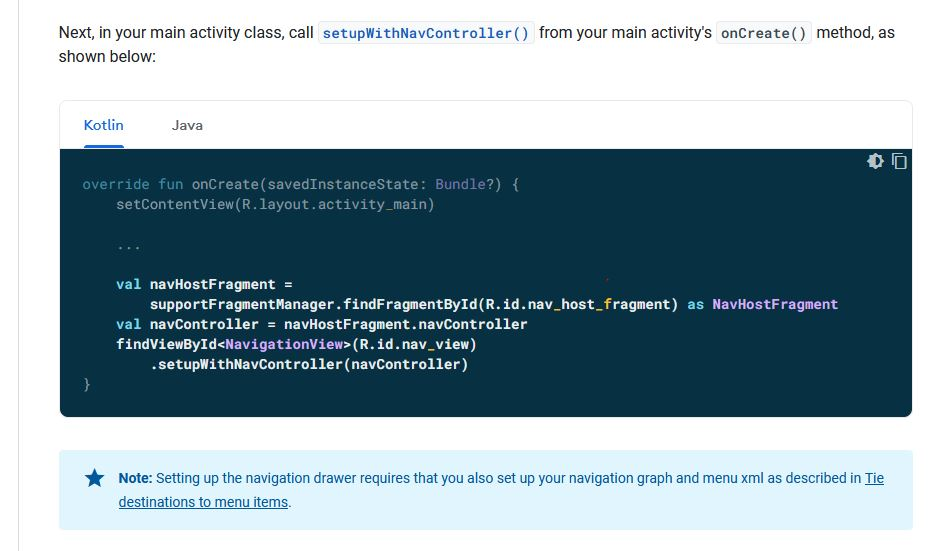

# Drawer with navigation component

This project shows the drawer layout **does not automatically close** when clicking the system back button.  
The drawer layout is set up with navController following [google doc](https://developer.android.com/guide/navigation/navigation-ui#add_a_navigation_drawer)

## What Google tell us to do

## Problem

## StackOverflow question:
[Navigation drawer doesn't close when setupWithNavController](https://stackoverflow.com/q/69513107/5777189)

## Conclusion
I have too high expectation for this feature, setting up drawer layout with navigation controller still require you to handle intercepting the back event and close the drawer yourselves.  
This is difficulty to do if it is a fragment hosting the drawer layout because there is no function for that hosting fragment to intercept child's system back click request.  
Easier way to handle this is put the drawer in Activity and override Activity's onBackPress() method, close drawer or manually navController.navigateUp().

Disappointed this restrict drawer layout only be usable in Activity

